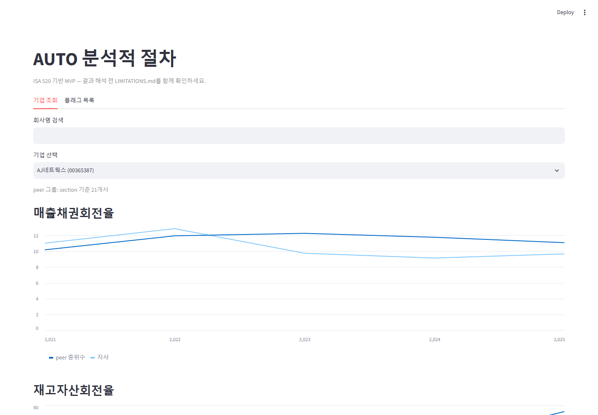
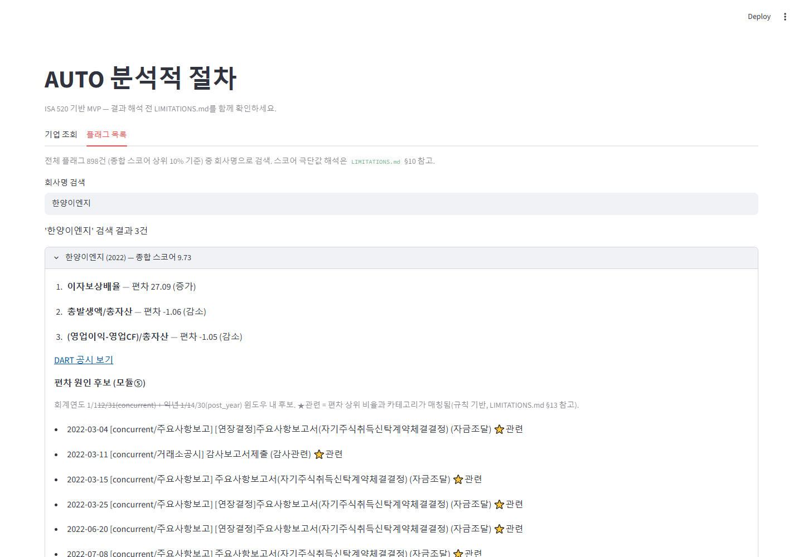
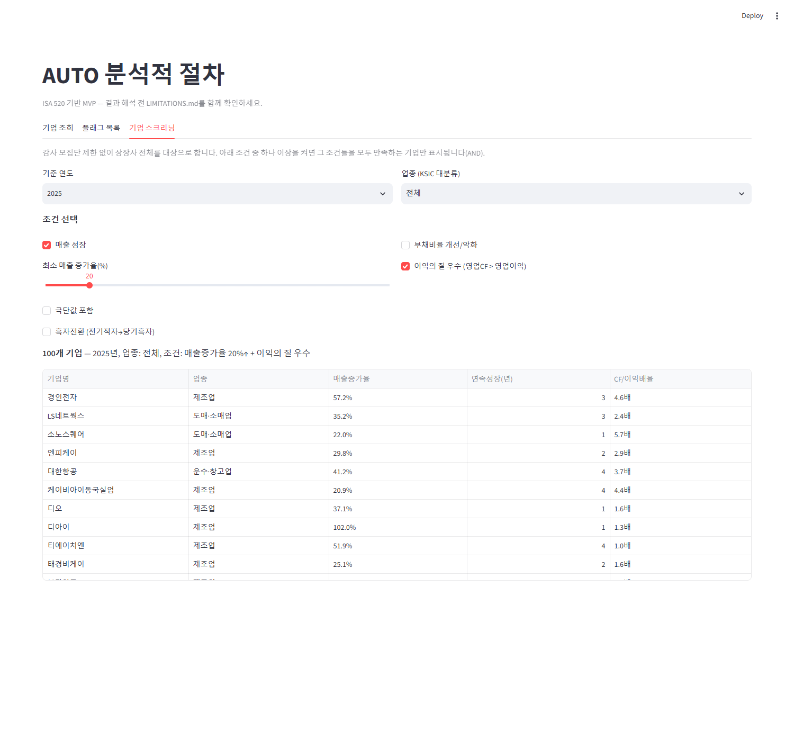
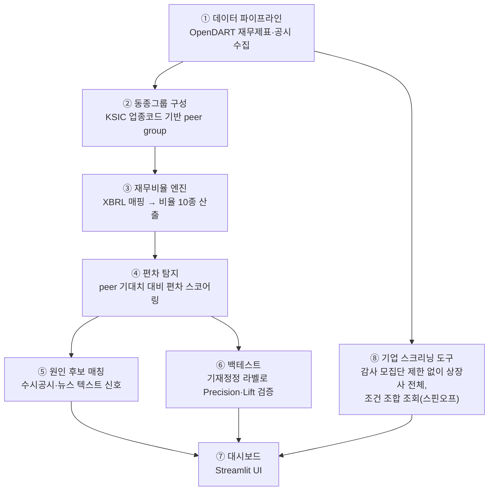
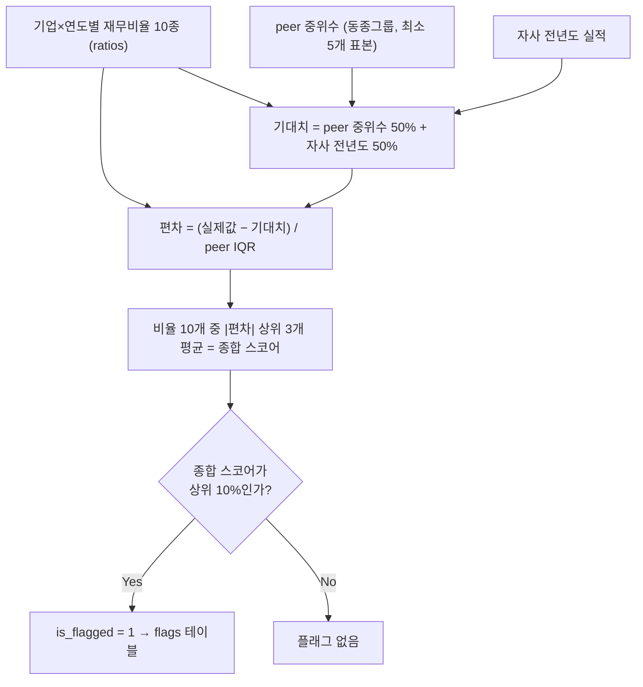

# 분석적 절차 자동화 — 데이터 파이프라인 + 기업 스크리닝 도구

동종업계 벤치마킹 기반 분석적 절차(ISA 520) 자동화 도구입니다. 상장사 재무데이터를
자동 수집해 peer(동종업계) 대비 이상 편차를 통계적으로 탐지하고, 편차 원인 후보를
뉴스·공시에서 자동으로 찾아 붙여줍니다. 같은 데이터 자산을 재사용해 매출 성장·
흑자전환 등 조건 기반으로 기업을 찾는 스크리닝 도구(⑧)도 함께 제공합니다.
전체 기획·설계는 `CLAUDE.md`, 알려진 한계는 `LIMITATIONS.md`를 참고하세요.

## 화면

| 기업 조회 | 플래그 목록 | 기업 스크리닝 |
|---|---|---|
|  |  |  |

## 구성 (모듈 ①~⑧)

| 모듈 | 역할 | 핵심 파일 |
|---|---|---|
| ① 데이터 파이프라인 | OpenDART 재무제표·공시 자동 수집 | `collect_*.py` |
| ② 동종그룹 구성 | KSIC 업종코드 기반 peer group, 표본 부족 시 상위 분류 fallback | `peer_group.py` |
| ③ 재무비율 엔진 | XBRL 표준계정 매핑(fallback 우선순위) + 핵심 비율 10종 산출 | `xbrl_mapping.py`, `compute_ratios.py` |
| ④ 편차 탐지 | peer 중위수+자사 전년도 기대치, IQR 기반 편차 스코어 | `detect_flags.py` |
| ⑤ 뉴스·공시 신호 | 편차 원인 후보를 수시공시·뉴스에서 규칙 기반으로 매칭 | `collect_disclosure_events.py`, `collect_news.py`, `match_signals.py` |
| ⑥ 백테스트 | 기재정정 라벨로 Precision@10%·Lift 검증 | `backtest.py` |
| ⑦ 대시보드 | 기업 조회·플래그 목록·편차 원인 후보를 보여주는 Streamlit UI | `dashboard.py` |
| ⑧ 기업 스크리닝 도구 (스핀오프) | 감사 모집단 제한 없이 상장사 전체 대상, 조건(매출 성장·흑자전환·부채비율·이익의 질)을 체크박스로 조합 조회 | `growth_screener.py`, `turnaround_screener.py`, `leverage_screener.py`, `cash_quality_screener.py`, `screening_common.py` |

핵심 판단 로직(④ 편차 스코어, ⑧ 스크리닝 조건)은 전부 통계·규칙 기반이며 LLM은
쓰지 않습니다(v2 로드맵의 리포트 서술 자동화 단계에서만 선택적으로 검토 중).

## 동작 흐름

### 전체 파이프라인 (① ~ ⑧)



①에서 수집한 재무데이터가 두 갈래로 쓰입니다: ②~⑥은 감사 모집단(`analysis_universe`,
1,905개)에 한정해 "이상 편차"를 판단하는 경로, ⑧은 그 제한 없이 상장사 전체
(3,976개)에서 "조건에 맞는 기업"을 찾는 별개 경로입니다. 둘 다 ⑦ 대시보드에서
같이 조회할 수 있습니다.

### ④ 편차 탐지 로직 상세



peer 중위수·IQR·자사 전년도 실적 모두 통계로만 계산되고(LLM 미사용), 이 스코어링
결과가 그대로 ⑦ "플래그 목록" 탭 표시 순서(종합 스코어 내림차순)가 됩니다. 임계값
(상위 10%)과 가중치(50:50)는 `detect_flags.py` 상수로 관리되며 근거는 `CLAUDE.md`
§6·`LIMITATIONS.md` §9~10 참고.

## 실행 환경

- Windows에서 `python` 명령이 MS Store 스텁으로 연결되는 경우가 있어 **`py` 런처를
  사용**합니다 (예: `py init_db.py`). Mac/Linux는 `python3`로 대체하세요.
- 터미널(Cursor·VS Code·PowerShell 등 아무 터미널이나 무방)에서 이 폴더로 이동 후
  아래 순서대로 실행합니다.

## 최초 설치

```bash
pip install -r requirements.txt
```

`.env` 파일을 프로젝트 루트에 직접 만들고 아래 내용을 채웁니다 (git에 올리지 말 것):

```
DART_API_KEY=발급받은_OpenDART_API_키
DB_URL=sqlite:///audit_ap.db

# 모듈⑤ 뉴스 신호(collect_news.py)에만 필요. 없어도 나머지는 전부 동작함.
# 발급: https://developers.naver.com/apps/#/register (검색 API 체크)
NAVER_CLIENT_ID=
NAVER_CLIENT_SECRET=
```

## 실행 순서 (전체 파이프라인)

```bash
# 1) DB 테이블 생성 (최초 1회, 이후 스키마 변경 시 재실행해도 안전)
py init_db.py

# 2) 상장사 기업코드 수집 → corp_master
py collect_corp_codes.py

# 3) 재무제표 수집 → financial_statements (처음엔 반드시 테스트 모드로!)
py collect_financials.py --test
py collect_financials.py            # 테스트 성공 확인 후 전체 수집 (수 시간, 중단 후 재실행하면 이어서 진행)

# 4) 공시목록 수집 → disclosures (기재정정 라벨 후보 포함)
py collect_disclosures.py

# 5) 업종코드·결산월 수집 → corp_master.industry_code / acc_mt
py collect_industry_codes.py

# 6) 분석 모집단 정의 → analysis_universe (금융업·비12월결산 제외, CFS 3개년 이상)
py build_analysis_universe.py

# 7) 재무비율 10개 계산 → ratios
py compute_ratios.py

# 8) 기대치·편차 탐지 → flags (peer 중위수+자사 전년도 가중 결합, 상위 10% 플래그)
py detect_flags.py

# 9) 미니 백테스트 → backtest_labels (Precision@10% + lift)
py backtest.py

# 10) 대시보드 실행 (기업 조회 + 플래그 목록 + 편차 원인 후보 + ⑧ 기업 스크리닝)
py -m streamlit run dashboard.py

# --- 여기부터 모듈⑤(뉴스·공시 텍스트 신호), v2 착수 항목 ---

# 11) 수시공시 수집 (주요사항보고·외부감사관련·거래소공시) → disclosure_events
#     시장 전체를 6개년치 스캔하므로 시간이 걸림. 재실행 안전.
py collect_disclosure_events.py

# 12) 뉴스 신호 수집 (모듈⑤ 소스 2, 온디맨드 — 특정 기업 1개씩 조회)
#     analysis_universe 전체를 배치 수집하지 않음(LIMITATIONS.md §14 참고)
py collect_news.py "기업명" [corp_code]

# 13) 편차 원인 후보 매칭 데모 (11·12 없이도 disclosure_events만으로 동작)
py match_signals.py                        # flags 상위 1건을 예시로 사용
py match_signals.py <corp_code> <bsns_year>  # 특정 기업·연도 지정
```

대시보드(10번)의 "플래그 목록" 탭에서 각 항목을 펼치면 12·13이 자동으로 통합되어
"편차 원인 후보 (모듈⑤)" 섹션에 표시된다. 뉴스가 미수집 상태면 그 자리에서
"뉴스 조회하기" 버튼으로 바로 수집할 수 있다.

각 스크립트는 재실행 안전(idempotent)합니다 — 중단되거나 다시 실행해도 이미 수집된
데이터는 건너뛰고 이어서 진행합니다. `peer_group.py`는 별도 실행용이 아니라
`get_peer_group()` 함수를 다른 스크립트에서 가져다 쓰는 모듈입니다
(`py peer_group.py`로 실행하면 동작 확인용 샘플 출력만 나옵니다).

## 현재 DB 상태 (2026-07-22 기준)

| 테이블 | 행 수 | 비고 |
|---|---|---|
| `corp_master` | 3,976개 기업 | industry_code·acc_mt 전부 채워짐. ⑧ 스크리닝 도구는 이 전체를 대상으로 함 |
| `financial_statements` | 약 126만 행 | BS/IS/CF/CIS만 (SCE는 데이터 손상으로 삭제, `LIMITATIONS.md` §7) |
| `disclosures` | 59,153건 | 2021~2026, 기재정정 라벨은 `correction_details`로 정제(아래 참고) |
| `correction_details` | 4,053건 | 정정사유 파싱 후 재무 관련 정정만 판별(`LIMITATIONS.md` §5) |
| `analysis_universe` | 1,905개 기업 | 금융업·비12월결산·CFS 3개년 미만 제외(①~⑦ 감사 모듈 전용 모집단) |
| `ratios` | 9,038개(기업×연도) | 10개 비율 중 9개가 매핑 커버리지 85% 이상 |
| `flags` | 9,038개(기업×연도) | 종합 스코어 계산 가능 8,974건(99.3%), 상위 10% 플래그 898건 |
| `backtest_labels` | 9,038개(기업×연도) | Precision@10% 10.91%, Lift **1.09배** — 여전히 무작위 수준, 원인은 `LIMITATIONS.md` §12 |
| `disclosure_events` | 288,150건 | 모듈⑤ 소스 1. 2021년~2026-07-16(최신)까지 수집 완료 |
| `news_signals` | 온디맨드(누적 207건) | 모듈⑤ 소스 2. 배치 수집 없음 — 대시보드에서 조회한 기업만 누적(`LIMITATIONS.md` §14) |

⑧ 기업 스크리닝 도구는 위 `financial_statements`/`corp_master`를 그때그때 계산하는
구조라 별도 테이블을 쌓지 않습니다(캐싱은 Streamlit `@st.cache_data`가 담당).

진행 단계는 STEP 1~5(분석 모집단·비율 엔진·기대치 편차 탐지·미니 백테스트·Streamlit
대시보드) 전부 완료되어 MVP 플로우가 일단락됐고, v2 항목인 ⑤ 텍스트 신호 모듈과
스핀오프 ⑧ 스크리닝 도구까지 구현된 상태입니다. 세부 계획은 `CLAUDE.md` §5 MVP
플로우 참고. STEP 3~4에서 발견된 이슈(비율 극단값, 실무 배포 시 당기값 입력 구조,
백테스트 Lift가 낮은 근본 원인 등)는 `LIMITATIONS.md` §9~12 참고 — 대시보드 결과를
해석하기 전에 반드시 함께 읽을 것.

## 참고

- 기본 DB는 SQLite(파일 하나짜리 DB)라 별도 설치가 필요 없습니다.
  실행하면 폴더에 `audit_ap.db` 파일이 생깁니다.
- PostgreSQL로 바꾸려면 `.env`의 `DB_URL`만 수정하면 됩니다.
- OpenDART는 일 20,000건 요청 제한이 있습니다. 한도 초과 시 스크립트가
  안내 메시지와 함께 종료되며, 다음 날 재실행하면 이어서 수집합니다.
- 분석 결과를 해석하기 전에 `LIMITATIONS.md`를 반드시 함께 읽으세요
  (생존편향, 라벨 노이즈 등 결과 해석에 영향을 주는 한계 기록).
